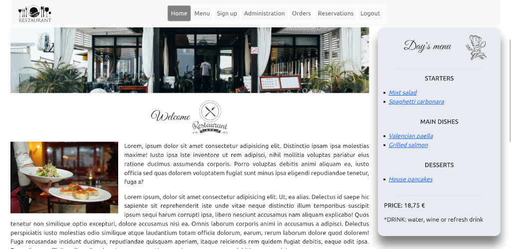
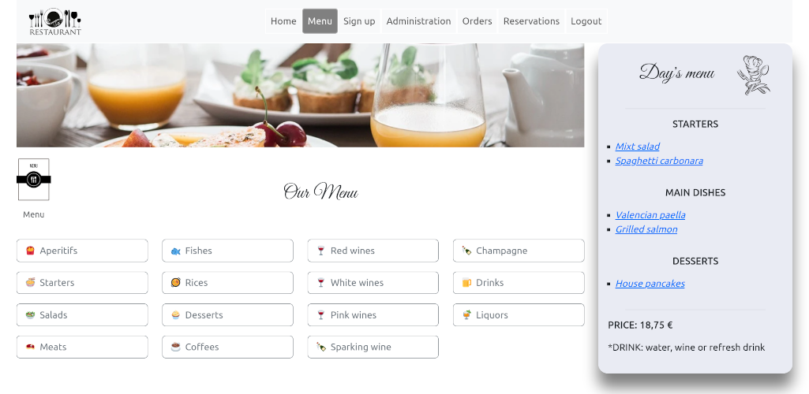
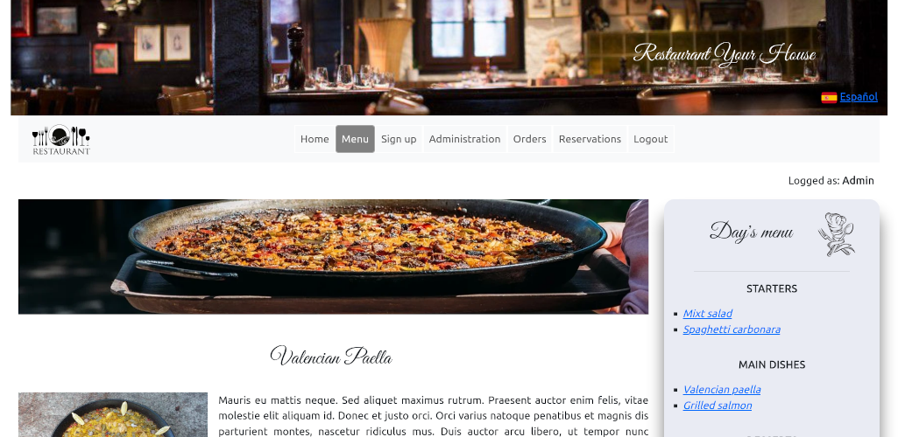
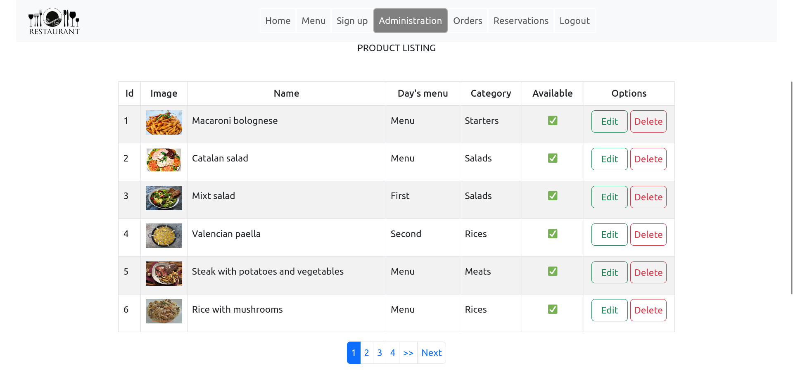
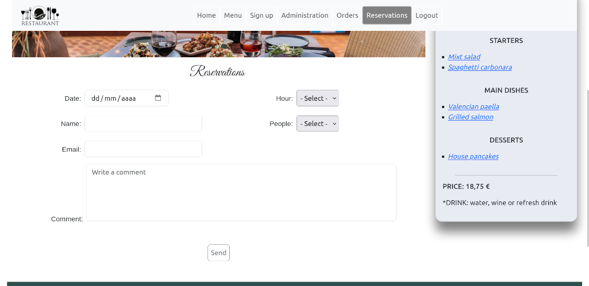

## Restaurant Management System

### Overview (Spanish)
<p>Este es un sistema de gestión integral para restaurantes que permite administrar todas las operaciones clave del negocio, incluyendo la visualización del menú, toma de pedidos, reservas y gestión de productos. Está diseñado para facilitar la operación diaria desde una interfaz centralizada.</p>

### Overview (English)
<p>This is a comprehensive restaurant management system designed to handle various aspects of a dining establishment, including menu display, order taking, reservations, and product management. It facilitates daily operations from a centralized interface.</p>

### Project's views
<p>Home view</p>
<br><br>

<p>Menu view</p>
<br><br>

<p>Dishe view</p>
<br><br>

<p>Products view</p>
<br><br>

<p>Reservations view</p>
<br><br>

### RESTAURANT SITE
1.- Clone the repository in a new directory called 'Restaurant'.
```
git clone https://github.com/u83mm/restaurant_php.git Restaurant
```

2.- Navigate to the new directory.
```
cd Restaurant
```
3.- Build the project and stands up the containers
```
docker compose build
docker compose up -d
```
4.- Access to db container and install dependencies
```
docker exec -it php bash
composer install
```
6.- Access to phpMyAdmin.
```
http://localhost:8080/
user: admin
passwd: admin
```
7.- Go to your localhost in the browser and you can do login.
```
http://localhost/
user: admin@admin.com
passwd: admin
```
