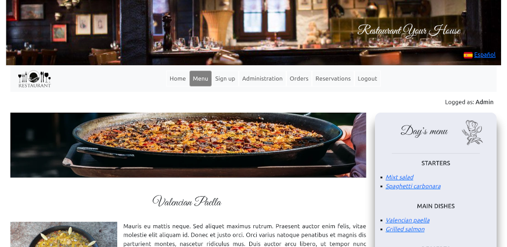
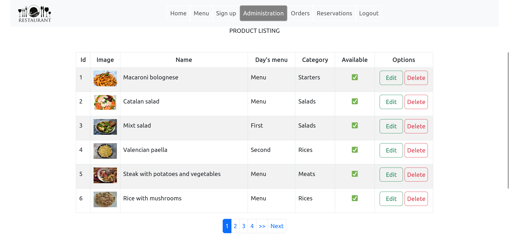

### Project's views
<p>Home view</p>
<br><br>

<p>Menu view</p>
<br><br>

<p>Dishe view</p>
<br><br>

<p>Products view</p>
<br><br>

<p>Reservations view</p>
<br><br>

### RESTAURANT SITE
1.- Clone the repository in a new directory called 'Restaurant'.
```
git clone https://github.com/u83mm/restaurant_php.git Restaurant
```

2.- Navigate to the new directory.
```
cd Restaurant
```
3.- Build the project and stands up the containers
```
docker compose build
docker compose up -d
```
4.- Access to phpMyAdmin.
```
http://localhost:8080/
user: admin
passwd: admin
```
5.- Select "my_database" and go to the "import" menu and search my_database.sql file in your "Restaurant" directory.

6.- Go to your localhost in the browser and you can do login.
```
http://localhost/
user: admin@admin.com
passwd: admin
```

